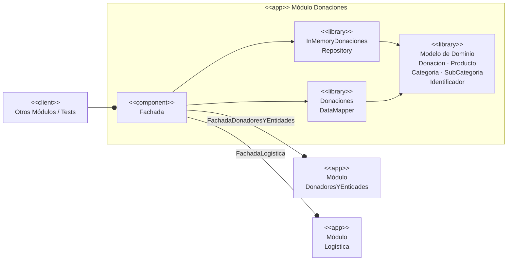
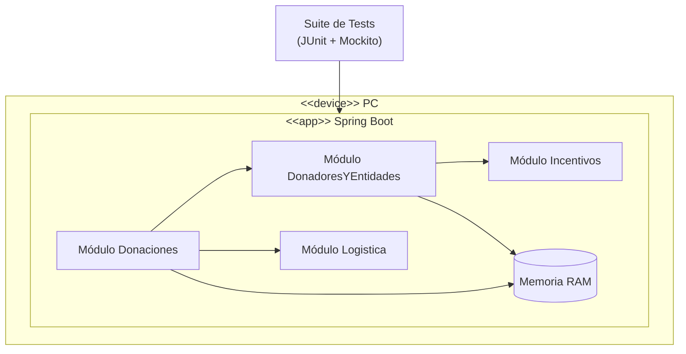

# Diagramas de Arquitectura — Módulo Donaciones

## Diagrama de Componentes

```mermaid
flowchart LR
 subgraph DONACIONES["&lt;&lt;app&gt;&gt; Módulo Donaciones"]
        FA["&lt;&lt;component&gt;&gt;<br>Fachada"]
        REPO["&lt;&lt;library&gt;&gt;<br>InMemoryDonaciones<br>Repository"]
        MAPPER["&lt;&lt;library&gt;&gt;<br>Donaciones<br>DataMapper"]
        MODEL["&lt;&lt;library&gt;&gt;<br>Modelo de Dominio<br>Donacion · Producto<br>Categoria · SubCategoria<br>Identificador"]
  end
    FA --> REPO & MAPPER
    REPO --> MODEL
    MAPPER --> MODEL
    CLIENT["&lt;&lt;client&gt;&gt;<br>Otros Módulos / Tests"] -- <br> --o FA
    FA -- FachadaDonadoresYEntidades --o DON_ENT["&lt;&lt;app&gt;&gt;<br>Módulo<br>DonadoresYEntidades"]
    FA -- FachadaLogistica --o LOG["&lt;&lt;app&gt;&gt;<br>Módulo<br>Logistica"]
```

## Diagrama de Despliegue

```mermaid
graph TD
    TEST["Suite de Tests<br>(JUnit + Mockito)"]

    subgraph MAQUINA["&lt;&lt;device&gt;&gt; PC"]
        subgraph APP["&lt;&lt;app&gt;&gt; Spring Boot"]
            DON["Módulo Donaciones"]
            DON_ENT["Módulo DonadoresYEntidades"]
            LOG["Módulo Logistica"]
            INC["Módulo Incentivos"]
            MEM[("Memoria RAM")]
        end
    end

    TEST --> APP
    DON --> DON_ENT
    DON --> LOG
    DON_ENT --> INC
    DON --> MEM
    DON_ENT --> MEM
```