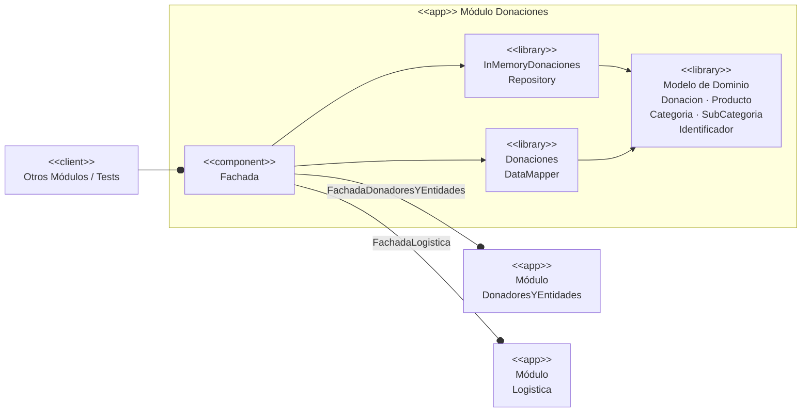
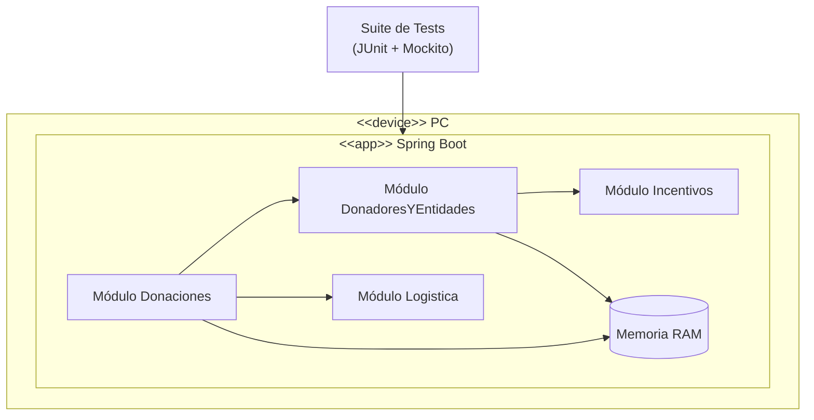
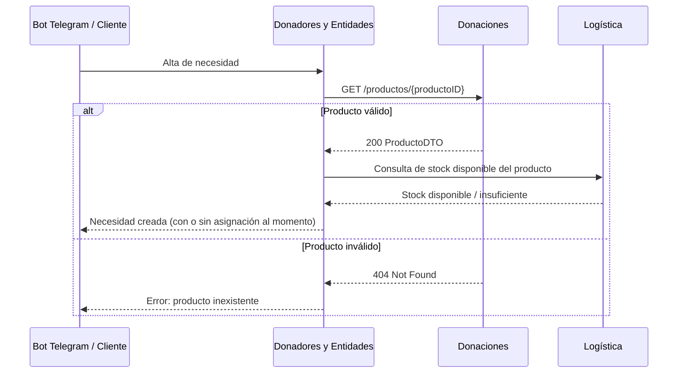
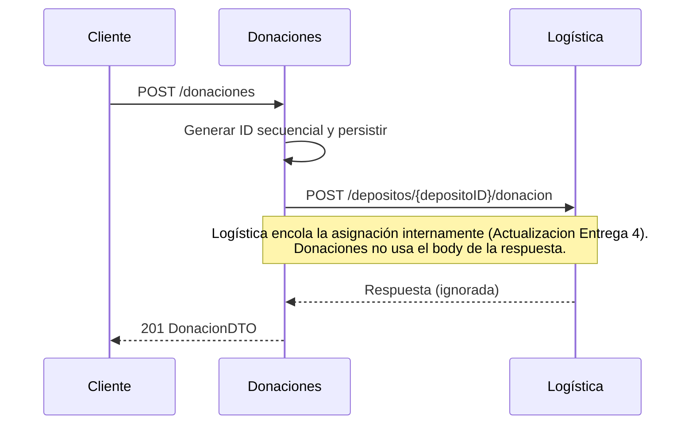

# Diagramas de Arquitectura — Módulo Donaciones

## Diagrama de Componentes

## Diagrama de Despliegue

## Diagrama de Secuencia — Entrega 4

El rol de este
módulo pasa por dos flujos de integración existentes que otros módulos consumen
o dependen de esta entrega en adelante:

### 1. Validación de producto al crear una necesidad

Donadores y Entidades corrobora contra Donaciones si el producto solicitado en
una necesidad existe, reutilizando el endpoint `GET /productos/{id}` ya
expuesto. No se agregó un endpoint nuevo porque el existente ya distingue
"producto válido" (200) de "producto inválido" (404) sin ambigüedad.

### 2. Registro de donación y notificación a Logística

El flujo de alta de una donación no cambió del lado de Donaciones. Lo relevante
para esta entrega es que la llamada a `gestionarDonacion` conecta con cola de Workers de Logística:
Donaciones no interpreta ni depende del cuerpo de la respuesta de Logística, por
lo que el pasaje de Logística a un modelo de stock + cola de trabajo no requiere ningún cambio en este módulo.

