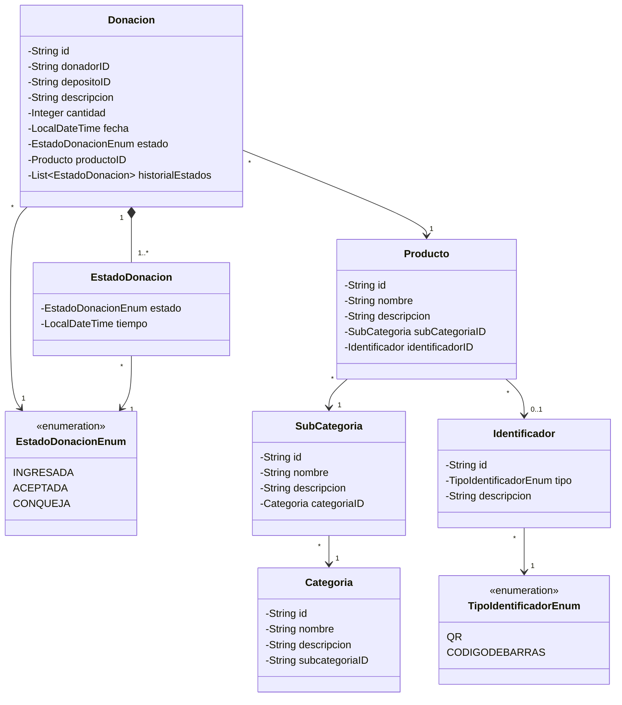

# Modelo del Dominio — Módulo Donaciones

```mermaid
classDiagram
direction TB
    class EstadoDonacion {
	    -EstadoDonacionEnum estado
	    -LocalDateTime tiempo
    }

    class EstadoDonacionEnum {
	    INGRESADA
	    ACEPTADA
	    CONQUEJA
    }

    class Categoria {
	    -String id
	    -String nombre
	    -String descripcion
	    -String subcategoriaID
    }

    class Identificador {
	    -String id
	    -TipoIdentificadorEnum tipo
	    -String descripcion
    }

    class TipoIdentificadorEnum {
	    QR
	    CODIGODEBARRAS
    }

    class Donacion {
	    -String id
	    -String donadorID
	    -String depositoID
	    -String descripcion
	    -Integer cantidad
	    -LocalDateTime fecha
	    -EstadoDonacionEnum estado
	    -Producto productoID
	    -List~EstadoDonacion~ historialEstados
    }

    class Producto {
	    -String id
	    -String nombre
	    -String descripcion
	    -SubCategoria subCategoriaID
	    -Identificador identificadorID
    }

    class SubCategoria {
	    -String id
	    -String nombre
	    -String descripcion
	    -Categoria categoriaID
    }

	<<enumeration>> EstadoDonacionEnum
	<<enumeration>> TipoIdentificadorEnum

    Donacion "1" *-- "1..*" EstadoDonacion
    Donacion "*" --> "1" Producto
    Donacion "*" --> "1" EstadoDonacionEnum
    EstadoDonacion "*" --> "1" EstadoDonacionEnum
    Producto "*" --> "1" SubCategoria
    Producto "*" --> "0..1" Identificador
    SubCategoria "*" --> "1" Categoria
    Identificador "*" --> "1" TipoIdentificadorEnum
```
